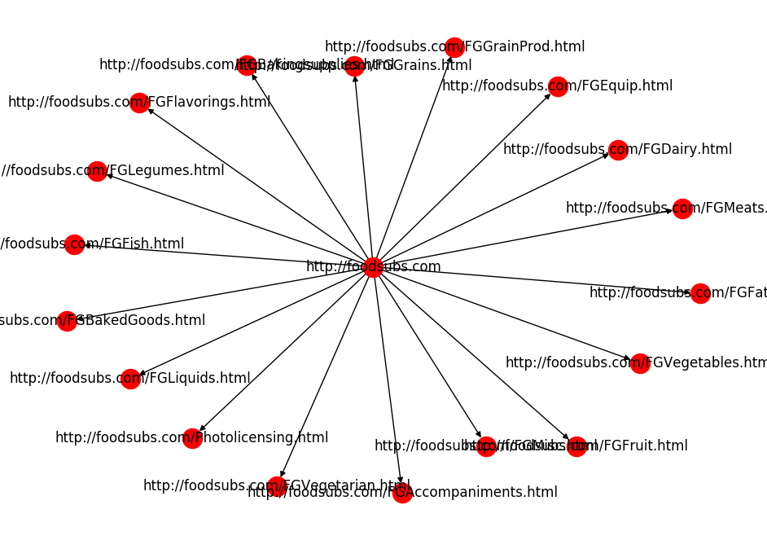

## Crawler

### Estructures de dades

* **DataBase**: La nostra base de dades és un diccionari amb dues claus, pàgines i paraules. Aquestes claus et permeten indexar  en subdiccionaris, que contenen informació sobre les relacions pàgina-caràcterístiques i  paraules-pàgines. 

  ``` python
  db = {
      'pages':{
          'url': {
              'url':
              'title':
          	'score': 
          }
      }
      'words':{
          'word': set(url)
      }
  }
  ```

* **Graf dirigit**: El graf dirigit és una xarxa de relacions, on el fill d'un node és una url que es troba en la web del node pare. S'utilitza la llibreria ```networkx``` per implementar un graf dirigit.

  ```python
  from networkx import DiGraph
  G = DiGraph()
  G.add_node(1)
  G.add_node(2)
  G.add_node(3)
  G.add_edge(1,2)
  G.add_edge(3,2)
  print(G.edges())
  >>> [(1,2),(3,2)]
  print(G.nodes())
  >>> [1,2,3]
  ```


* **Cua**: Per poder implementar l'algorisme BFS necessitem una cua on anar guardant les url sota la política FIFO. En el nostre cas implementem una cua on cada entrada és una llista de dos elements,(link, distància a explorar). S'utilitza la llibreria deque per implementar la cua, atès a l'eficiència de la seva implementació.

  ``` python
  from collections import deque
  queue = deque()
  #els elements s'afegeixen a l'esquerre per tenir la representacio d'una cua
  queue.appendleft(1)
  queue.appendleft(2)
  queue.appendleft(3)
  queue.pop() #elimina de la cua l'element més a la dreta i el retorna
  >>> 1
  print(queue)
  >>> 2 3
  ```


### Complexitat

Per descriure la complexitat algorísmica s'utilitzarà notació asimptòtica:

- Relació complexitat funció/acció:

  |                  $O(1)$                  |                  $O(n)$                  | $O(n²)$                   |
  | :--------------------------------------: | :--------------------------------------: | ------------------------- |
  |             Crear cua i set              |                getSoup()                 | scrapeSite() (Worst Case) |
  | Afegir/Eliminar element en la cua, diccionar (Average Case), set | Afegir element en un diccionari (Amortized Worst Case) |                           |
  |   Mirar si un element és  dins un set    |       scrapeSite() (Average Case)        |                           |
  | Consultar element d'una llista indexant  |                getLinks()                |                           |
  | Afegir element en un diccionari (Average Case) |                                          |                           |
  |              sanitizeUrl()               |                                          |                           |
  |         Afegir aresta en el graf         |                                          |                           |


### Algorisme

El crawler està basat en l'algorisme Breadth First Search (**BFS** ) . Aquest algorisme permet poder anar recorrent layer per layer, i així en cas de trobar una pàgina ja visitada no tenim la necessitat d'explorar-la.

* El curs del nostre algorisme és el següent:
  1. Afegir la pàgina pare, juntament amb la distància a explorar, en la cua i inicialitzar un set buit que ens indicarà si hem visitat. 

     - Complexitat: $O(1)$

  2. Executar el **BFS** fins que no hi hagi elements a la cua, és a dir, fins que no haguem de visitar cap més link.

     - Complexitat: $O(V)$ , $V = links$ $no$ $visitats$  

       2.1. Agafem tota la sopa mitjançant funció auxiliar,getSoup(), i en cas d'error retorna un element buit.  

       - Complexitat: $O(t)$, $t = Text$

         2.2. Si hem pogut agafar la sopa, actualitzem la nostra data base. L'actualització es    divideix en: 

         ​2.2.1. Afegir en la `(db['pages']['url'])` les tres característiques pertanyen al link.

         ​2.2.2.  Escanejar el text, a través de la funció scrapeSite(), i anar afegint les paraules del text  

         ​	   en   `set(db['words']['word'])` i assignar un nou link.                 

       | Afegir element diccionari | Afegir element set |     scrapeSite()     | Complexitat |
       | :-----------------------: | :----------------: | :------------------: | :---------: |
       |   Average Case: $O(1)$    |       $O(1)$       | Worst Case: $O(t·p)$ |  $O(t·p)$   |
       |   Average Case: $O(1)$    |       $O(1)$       | Average Case: $O(t)$ |   $O(t)$    |
       |    Worst Case: $O(n)$     |       $O(1)$       | Average Case: $O(t)$ |  $O(n+t)$   |
       |    Worst Case: $O(n)$     |       $O(1)$       | Worst Case: $O(t·p)$ |  $O(t·p)$   |

       $n =nombre$ $de$ $links$ $\wedge $  $p = paraules$ $sanejades$ $visitades$

       2.3. Si la distància a explorar és més gran que 0, explorem els fills.

       - Complexitat: $O(n)$

       2.4.  Per cada fill afegim l'aresta entre el node del link pare i el node del fill en el graf. Si no l'hem visitat, és a dir, no es troba en el set de visit l'afegim a la cua. D'altre banda l'afegim a visit.

       - Complexitat: $O(n)$


**Complexitat total** (Average Case) : $O(1)+O(V)+O(t)+O(n+t)+O(n))+O(n)=O(V+n+t)$

Aquest anàlisis és una forma abstracta d'entendre que l'algorisme visita cada node i aresta tan sols un cop, i per cada node es llegeix la seva pàgina. 


### Page Rank

El Page Rank és un algorisme utilitzat per ponderar pàgines webs en funció dels enllaços que l'apunten. És a dir, com més webs m'apunten més rellevància té la meva pàgina web. Aquest algorísme és el que permet a l'hora de realitzar queries tenir un ordre d'importànica envers les pàgines webs.  

Durant l'execucció del crawler es genera el graf dirigit que ens donarà aquesta relació  pare-fill. Un cop tenim tot el graf construit, del nostre crawling, podem aplicar el Page Rank. L'algorisme s'importa de la llibreria ```networkx``` , igual que la construcció del graf. Aquest algorisme converteix el graf en una matriu d'adjacència, on es divideix cada columna pel nombre d'elements en ella. Llavors, la  matriu esdevé Estocàstica per columnas. Aplicant el Teorema de Perron-Frobenius, s'obté que el VAP dominant és 1 i el seu VEP és l'únic amb totes les entrades positives. Calculant la distribució estable (dividir per la suma de les components del vector)  s'obté la distribució desitjada.

Finalment, actualitzem la nostra base de dades en funció dels scores obtinguts en el Page Rank, és a dir, a cada web li assignem la seva rellevància.


### Execució

Per a realitzar crawling d'un web, cal executar:

```python crawler.py -u [URL] -m [MAXDIST]``` , més informació sobre flags i opcions al fitxer ```crawler.py```

#### Exemples d'execució i resultats


<center>Crawling a http://upc.edu amb maxdist 1</center>





<center>Crawling a http://foodsubs.com amb maxdist 1</center>


<center>Crawling a http://foodsubs.com amb maxdist 2</center>


### Processament de la Query

Donada una *query*, que serà del tipus string, la funció ```answer(db, query)``` retornarà una llista de resultats que el mòdul ```server.py``` i posteriorment el sistema de *templating* de l'HTML processaran i mostraran a l'usuari que hagi realitzar la query.

Donada la *query* en format string, el primer que fa la funció és crear una llista de paraules fent un ``split`` en els espais. Una vegada tenim la llista de paraules, és fa servir l'objecte ```db['words']``` per trobar el conjunt de pàgines on es troba cada paraula. Si no hi ha cap conjunt de pàgines per a una paraula en particular, afegim el conjunt buit a la llista.

Després es calcula la **intersecció** d'aquests conjunts. Això permet trobar el un llistat de les pàgines que contenen **cada paraula** de la *query*. Amb aquest llistat, en generem un altre amb la informació pertinent de cada pàgina. Serà aquest llistat (ordenat per *pagerank scores*) el que retornarem a la interfície controladora.


## Dependències

Llista de paquets necessaris per a executar ```moogle.py ```

```
networkx==2.1
Flask==0.12.1
stop_words==2015.2.23.1
requests==2.6.0
urllib3==1.21.1
matplotlib==2.0.0
PyPDF2==1.26.0
beautifulsoup4==4.6.0
```

Per instal·lar és tant senzill com executar la següent comanda: ```pip install -r requirements.txt```

o en cas de necessitar permisos d'administrador o root: ```sudo pip install -r requirements.txt ```
